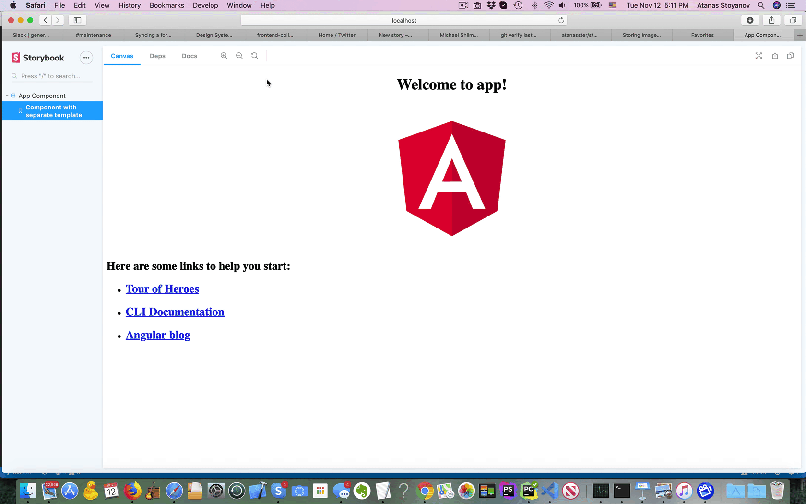

# storybook-addon-deps

A storybook addon to add a dependencies tree exporer tab.<br />
Works in conjunction with [storybook-dep-webpack-plugin](https://github.com/atanasster/storybook-dep-webpack-plugin/)


## DocsPage demo 
[grommet-controls](https://atanasster.github.io/grommet-controls/?path=/docs/controls-controls-avatar--main)

## Install and configure `storybook-dep-webpack-plugin`
[storybook-dep-webpack-plugin](https://github.com/atanasster/storybook-dep-webpack-plugin/blob/master/README.md)


## Installation
```sh
npm i -D storybook-addon-deps
```

## Usage
In your storybook config.js, define some global parameters to exchange the data collected by the `storybook-dep-webpack-plugin`


```js
import { configure, addDecorator, addParameters } from '@storybook/{yourframework}';

addParameters({
 dependencies: {
    //display only dependencies/dependents that have a story in storybook
    //by default this is false
    withStoriesOnly: true,

    //completely hide a dependency/dependents block if it has no elements
    //by default this is false
    hideEmpty: true,
  }
});
```

## A. Add a documentation block to your DocsPage (optional)
DocsPage is the zero-config default documentation that all stories get out of the box.
You can add a **Dependencies** block to any level to your storybook

**Globally (config.js)**

```js
import { DocsPage } from 'storybook-addon-deps/blocks/DocsPage';
addParameters({ docs: { page: DocsPage } });
```

**Component-level (Button.stories.js)**

```js
import { Button } from './Button';
import { DocsPage } from 'storybook-addon-deps/blocks/DocsPage';
export default {
  title: 'Demo/Button',
  component: Button,
  parameters: { docs: { page: DocsPage } },
};
```

**Story-level (Button.stories.js)**

```js
import { Button } from './Button';
import { DocsPage } from 'storybook-addon-deps/blocks/DocsPage';
// export default { ... }
export const basic => () => <Button>Basic</Button>
basic.story = {
  parameters: { docs: { page: DocsPage } }
}
```

## B. Add dependencies and dependents doc blocks to mdx stories (optional)
**Button.stories.mdx**

```jsx
import {
  Story,
  Preview,
  Props,
  Description,
  Meta,
} from '@storybook/addon-docs/blocks';
import { Button } from '@storybook/design-system/dist/components/Button';
import { Dependencies, Dependents } from 'storybook-addon-deps/blocks';

<Meta
  title="Design System|Button"
  component={Button}
  parameters={{ component: Button }}
/>

# Selected story

<Preview withToolbar={true}>
  <Story id="." />
</Preview>

# Properties
<Props of={Button} />

# Dependencies doc block
<Dependencies of={Button} />

# Dependents doc block
<Dependents of={Button} />
```

## C. Add a dependencies tab to storybookjs (optional)

in the `addons.js` file in your storybook config, register `storybook-addon-deps`:

```js
import 'storybook-addon-deps/register';
```

in the `config.js` file, add the dependeny context provider (in order to exchange data with the dependencies tab panel)
```js
import { configure, addDecorator, addParameters } from '@storybook/{yourframework}';
import { withDependenciesContext } from 'storybook-addon-deps';
...
addDecorator(withDependenciesContext);
...
```

# Project analysis
The charts used are [Google Charts](https://react-google-charts.com) and all their properties are applicable. Detailed information on configuration options is available from Google documentation, for example [Pie Chart](https://developers.google.com/chart/interactive/docs/gallery/piechart#configuration-options) options.

```
import { Meta } from '@storybook/addon-docs/blocks';
import { ChartComponentUsage, ChartStoriesPerComponent } from 'storybook-addon-deps/blocks';
  
<Meta title="About|Dashboard" />
<ChartStoriesPerComponent />
<ChartComponentUsage />
```

## Stories per component
```
import { SectionTitle, ChartStoriesPerComponent } from 'storybook-addon-deps/blocks';
<SectionTitle>Stories per component</SectionTitle>
<ChartStoriesPerComponent
  height='500px'
  options={{
    sliceVisibilityThreshold: 0.04,
    pieSliceText: 'value',
    s3D: true,
    pieHole: 0.7,
  }}
/>
```

## Components by usage

Displays how many times each component is used by other components.
```
import { SectionTitle, ChartStoriesPerComponent } from 'storybook-addon-deps/blocks';
<SectionTitle>Components usage</SectionTitle>
<ChartComponentUsage
  height='500px'
  options={{
    minColor: '#009688',
    midColor: '#f7f7f7',
    maxColor: '#ee8100',
  }}
/>
```

# Other frameworks
## web-components


## angular


## vue
